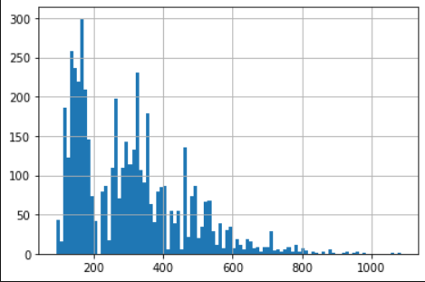

# Data-Science-Challenge

## Question 1: Given some sample data, write a program to answer the following: click here to access the required data set

On Shopify, we have exactly 100 sneaker shops, and each of these shops sells only one model of shoe. We want to do some analysis of the average order value (AOV). When we look at orders data over a 30 day window, we naively calculate an AOV of $3145.13. Given that we know these shops are selling sneakers, a relatively affordable item, something seems wrong with our analysis.

a. Think about what could be going wrong with our calculation. Think about a better way to evaluate this data.\
b. What metric would you report for this dataset?\
c. What is its value?\

## Answers:

a.Inside this dataset, we have store 78 and store 42 exhibit abnormalies.

- Store 42, there is 1 user that keep order up to 2000 sneakers which is very weird, so most likely this is a bad data to include in our dataset.
- Store 78, the order_value for only a small amount of sneakers can not be as high as \$100000. Therefore, we should exclude this data.

b. For this dataset, it would be much wiser to report the most common order value (mode) and the 50th percentile order value (median). I believe we should these 2 metrics because they tell us what is the order value that often happens and what is the spread of each order value. Also, these 2 metrics help us preventing abnormal data like that of store 42 and store 78.

This helps us get a better understand what is the current performance across 100 stores without much inteference from outliners.

c.
Median: 284
Mode: 153

VIEW: https://github.com/heerman7737/Shopify-Application-Challenge/blob/main/Q1.ipynb

## Question 2: For this question you’ll need to use SQL. Follow this link to access the data set required for the challenge. Please use queries to answer the following questions. Paste your queries along with your final numerical answers below.

a. How many orders were shipped by Speedy Express in total?\
b. What is the last name of the employee with the most orders?\
c. What product was ordered the most by customers in Germany?\

## Answers:

a. Check ShipperID from Shippers and Orders table then from there, we match that with shipper "Speedy Express".

ANSWER: 54

b. We select from Employees and Orders table to get EmployeeID. Then we get the last name of the person with most orders.

ANSWER: PEACOCK

c. We select ProductID with the largest order from Product table. Then we search the Customer table for people from GERMANY. Then we match ProductID with largest order with those PRoductID ordered by people from Germany.

ANSWER: Boston Crab Meat.
